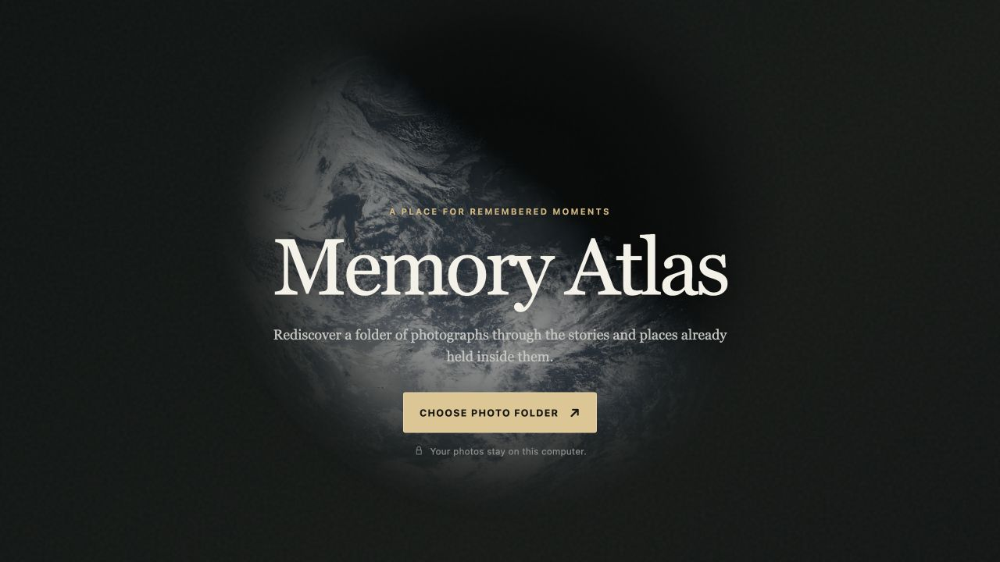

# Memory Atlas

Memory Atlas is a local-first macOS photo viewer for rediscovering personal
photos through the context already embedded in them: captions, capture time, and
where available, location.

Status: **MVP / proof of concept.** The core app is implemented and can be
packaged as a self-contained macOS DMG for local testing. The source is public;
[0.2.2 is available as an unnotarized tester prerelease](https://github.com/chrwittm/memory-atlas/releases/tag/v0.2.2).
The current source is the 0.3.0 navigation and map release candidate described
below.



## Try the app

Release availability is shown on
[GitHub Releases](https://github.com/chrwittm/memory-atlas/releases):

1. Open the [Releases page](https://github.com/chrwittm/memory-atlas/releases).
2. Download the latest `Memory.Atlas-<version>-<architecture>.dmg`.
3. Open the DMG and drag **Memory Atlas** to **Applications**.
4. Launch **Memory Atlas** and choose a local folder of JPEG photos.

The [Memory Atlas user guide](docs/user-guide.md) explains folder requirements,
every viewer control, keyboard shortcuts, map behavior, and common recovery
steps.

The [release notes](RELEASE_NOTES.md) describe the 0.3.0 candidate, public 0.2.2
security replacement, and historical local builds.

For Apple silicon Macs, download the `arm64` DMG. For Intel Macs, download the
`x64` DMG if one is published. The current MVP build is ad-hoc signed for local
testing, not Developer ID notarized, so the first launch may require **System Settings → Privacy & Security →
Open Anyway**. See [Apple’s instructions](https://support.apple.com/guide/mac-help/mh40616/mac).

For maintainers, the exact packaging runbook is in
[docs/operations/macos-packaging.md](docs/operations/macos-packaging.md). Generated DMGs belong on GitHub
Releases, not committed into the repository.

## What the MVP does

- Opens a user-selected local folder of top-level `.jpg`, `.jpeg`, and `.gpx`
  files; GPX files enrich the map while JPEGs remain the displayed collection.
- Shows photos in natural file-name order, so names like `001`, `002`, `003`
  control the sequence.
- Zooms and pans readable photos for detail inspection, with fitted, native
  100%, and per-photo remembered custom views.
- Reads embedded EXIF, TIFF, IPTC, and XMP metadata in a Web Worker.
- Shows embedded captions and capture time when available.
- Opens an optional split map with current-photo, all-located-photo, and
  photos-plus-GPX-track modes, including clustered marker selection.
- Uses a short map-focused `Z` cycle for Current photo, Day, Complete track,
  and All photos, plus a grouped Zoom menu for direct access to every available
  temporal, German or U.S. geographic, collection, and track scope.
- Keeps original photo files read-only and local.

Map mode loads map tiles from OpenFreeMap. Photo files and extracted metadata
are not uploaded by the app.

## Current limitations

This is intentionally a narrow POC:

- macOS only for now.
- JPEG folders only; no HEIC, RAW, videos, or nested folder import yet.
- No library database, accounts, cloud sync, uploads, generated index, or
  automatic updates.
- Normal distribution needs Apple Developer ID signing and notarization;
  tester prereleases are explicitly unnotarized.

See [known issues](docs/planning/known-issues.md) for observed MVP defects and current
workarounds.

## Run from source

Memory Atlas requires Node.js 24.20.0 or later in the 24.x line and npm 11.19.0, as declared in
`package.json`. Use `npm ci` to install the exact dependency versions from the
lockfile. If Node.js is managed with NVM, activate the repository's `.nvmrc`
version first.

```bash
nvm use
npm ci
npm run dev
```

If a new terminal reports `node: command not found` or `npm: command not found`,
run `nvm use` from the repository root before retrying. Installing dependencies
is unnecessary when `node_modules` is already current.

Open the local address printed by Vite, choose a folder, and select it through
the browser's folder picker.

Quality checks:

```bash
npm run check
npm test
npm run build
npm run audit:prod
npm run audit:all
```

`svelte-check` is the project's source-quality gate. A separate formatting or
linting tool is intentionally deferred until it provides checks that this gate
does not already cover. Dependency audit results are evaluated under the
[dependency security policy](docs/operations/dependency-security.md), including
development and packaging paths. The audit commands contact npm's advisory
service and submit the dependency metadata needed to perform that check.

Create and automatically verify a macOS release candidate from a clean working
tree:

```bash
npm run release:mac -- --allow-network-audit
```

The explicit flag confirms the npm advisory lookup. The release gate installs
the locked dependencies, checks the reviewed audit baseline, runs all source
checks, creates the architecture-specific DMG, verifies its contents and macOS
signatures, and writes an ignored machine report plus a verification-document
draft under `out/release/`. It prints only a compact pass/fail summary; detailed
command output stays in ignored log files. `npm run make:mac` remains the
lower-level package command for focused troubleshooting, not the complete
release gate.

## Project documentation

- [Release notes](RELEASE_NOTES.md)
- [User guide: features, controls, and keyboard shortcuts](docs/user-guide.md)
- [Documentation map and authoring workflow](docs/README.md)
- [Living project context](docs/product/context.md)
- [Living product backlog and feature workflow](docs/planning/backlog.md)
- [Accepted MVP specification](docs/product/specifications/mvp.md)
- [macOS deployment instructions](docs/operations/macos-packaging.md)
- [Known issues and workarounds](docs/planning/known-issues.md)
- [Repository guide for agents and contributors](AGENTS.md)

The original proposal remains available at
[docs/archive/product/intent-v1.md](docs/archive/product/intent-v1.md), but it is historical and
not an implementation specification.

## Repository structure

```text
src/                  Svelte app, photo ingestion, metadata normalization, tests
electron/             Electron main process for the packaged desktop app
docs/                 product, planning, architecture, operations, and delivery records
public/images/        public visual assets served unchanged by Vite
fixtures/             private local test-photo folders, ignored by Git
forge.config.cjs      Electron Forge packaging configuration
```

Generated, non-personal test assets live under `src/test/fixtures/`. Private
photo folders remain under `fixtures/photo-folders/` and are ignored by Git.

The local `fixtures/photo-folders/2026-06-20-Schlossherrenrunde/` collection is
the representative corpus for metadata and viewer testing when present. It is
kept outside `public/` and ignored by Git because it may contain personal and
location metadata.

## Publishing a POC release

Before pointing a blog post or external audience at the app:

1. Review the [publication gates](docs/delivery/plans/2026-09-04-publication-readiness.md),
   asset provenance, and source privacy.
2. Run `npm run release:mac -- --allow-network-audit` on the target Mac
   architecture and complete the manual installed-app checklist.
3. Create a [GitHub Release](https://github.com/chrwittm/memory-atlas/releases/new), mark it as a pre-release if
   the POC caveats still apply, and upload the generated DMG as the release
   asset.
4. Include the DMG SHA-256 checksum and the notarization caveat in the release
   notes.
5. Link readers to the [latest release](https://github.com/chrwittm/memory-atlas/releases) rather than to a
   committed binary file.

## License

Memory Atlas source code is licensed under [Apache-2.0](LICENSE). Third-party
dependencies retain their own licenses. The NASA entry-screen image is covered
by its separate [source and reuse record](public/images/README.md); NASA does
not endorse Memory Atlas.

Report vulnerabilities through the confidential route in [SECURITY.md](SECURITY.md).
